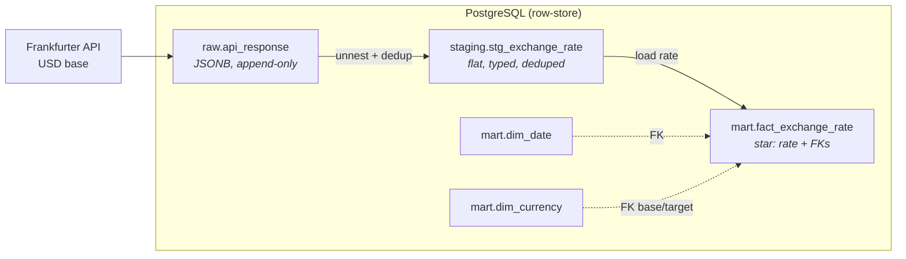
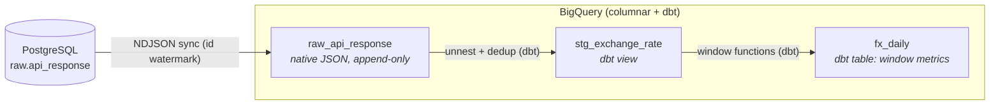

# fx-elt-pipeline


**A daily FX ELT pipeline, rebuilt on BigQuery + dbt to explore how the storage engine shapes data design.**

Medallion architecture (raw → staging → mart), with data quality tests, source definitions, and generated lineage documentation. Moving from a row-oriented database to a columnar warehouse changes how data can be modeled, transformed, and consumed.

**Stack:** BigQuery · dbt · PostgreSQL · Python · SQL · medallion architecture · dimensional modeling

Why FX rates suit this: they come on a daily cadence, form a naturally incremental series, and carry analytical metrics like moving averages and volatility that give the modeling decisions something concrete to answer to.

> **Why rebuild instead of starting a new project?**
> Rather than spin up a separate BigQuery project, I rebuilt the same ELT pipeline to see which parts of the design carry over and which need to change when moving from PostgreSQL to BigQuery.
> The interesting part was understanding why the **same** FX data is modeled as a dimensional **star schema** on PostgreSQL, but as a wide **One Big Table (OBT)** on BigQuery. **Same data. Different engine. Different modeling decisions.**

---

**Quick nav:** [Architecture](#architecture) · [Engineering Decisions](#engineering-decisions) · [Tech Stack](#tech-stack) · [How to Run](#how-to-run) · [Data Models](#data-models) · [Evolution & Roadmap](#project-evolution--roadmap) · [Structure](#project-structure)

---

## Architecture

Two builds of the same ELT run side by side: one on a row-store and one on a columnar warehouse, both using the same raw data. PostgreSQL remains the source of truth, while BigQuery's raw layer is synced from PostgreSQL rather than fetched through a second API call. The raw records therefore remain the same across both builds; only the downstream modeling and transformation differ by engine.

**PostgreSQL (row-store)**



**BigQuery + dbt (columnar)**



Same three layers map to different objects on each engine:

| Layer | PostgreSQL | BigQuery + dbt |
|-------|-----------|----------------|
| **Raw** | `raw.api_response` (JSONB) | `raw_api_response` (native JSON) |
| **Staging** | `staging.stg_exchange_rate` | `stg_exchange_rate` (dbt view) |
| **Mart** | `mart.fact_exchange_rate` (star) | `fx_daily` (dbt table, OBT) |

Each engine ends up with one mart design, not two: PostgreSQL as a dimensional star schema, BigQuery as a wide OBT. *Why* is covered in [Engineering Decisions](#engineering-decisions).


---

## Engineering Decisions

The data stayed the same between versions; the engine changed. That difference drove the design decisions below.

### Why a star schema on PostgreSQL but an OBT on BigQuery?

The same dataset is modeled differently on each engine because their storage and query characteristics differ. The choice is not stylistic; it follows from how each engine handles analytical queries.

**PostgreSQL (row-store).** Rows are stored together, and joins to small dimensions are relatively cheap, so a dimensional star schema fits well. `fact_exchange_rate` holds the raw `rate`, with `dim_date` and `dim_currency` providing the dimensions. This keeps the fact flexible for different ways of slicing the data without reshaping it.

**BigQuery (columnar).** Only the columns referenced by a query need to be scanned, so a wide table avoids reading unused columns, while pre-joining the data reduces the need for joins at query time. This fits BigQuery's columnar storage model, making a single One Big Table (`fx_daily`) a better fit than a star schema here. `dim_currency` is also tiny and attribute-poor (just a currency code), so there is little to gain from separating it into a dimension.

**Trade-off.** The OBT is more rigid: adding a metric means changing the schema rather than writing another query against existing dimensions. At this scale, that is an acceptable cost, and the wider shape fits the way the columnar engine reads data.

One caveat: this reasoning is based on the characteristics of each engine, not on benchmarks against this dataset. With five currency pairs at a daily cadence, the two designs would likely perform similarly. The point of the exercise is therefore the modeling decision, not a measured performance advantage.

### Why store raw JSON instead of flattening on ingestion?

Transforming during ingestion means the original API payload is no longer available for reprocessing. If the transformation logic changes later, the data must be fetched from the source again.

Both pipelines therefore land the untouched API payload first (`JSONB` on PostgreSQL, native `JSON` on BigQuery) before any transformation. Raw data stays immutable and replayable, so downstream layers can be rebuilt from the stored payload without re-ingesting the source. This also keeps ingestion separate from transformation: the extract step only lands the data, while all shaping happens later in SQL.

**Trade-off.** Raw JSON uses more storage than pre-flattened rows, and downstream reads require parsing the payload. At this scale, both costs are negligible compared with the benefit of replayability.

### Why mirror Postgres raw into BigQuery instead of calling the API twice?

A second, independent API caller would risk the two raw layers drifting out of sync. Instead, PostgreSQL raw is the single source of truth, and BigQuery raw is fed from it: the sync copies only rows past BigQuery's `MAX(id)` watermark (one `id` is one ingestion batch), writes them as NDJSON, and appends them with an atomic BigQuery load job.

**Safe to re-run.** The watermark reflects only rows that actually landed in BigQuery, so a failed load leaves it unchanged and re-running the pipeline re-copies the same rows, with no gap and no duplicate. Recovery is a plain re-run, not automatic detection. PostgreSQL stays authoritative regardless of what happens to the BigQuery side.

**Why NDJSON, not CSV or a JSON array.**

Raw needs to preserve the payload as received. CSV would flatten the nested payload during loading and lose that structure. BigQuery's batch loader expects newline-delimited JSON rather than a single JSON array, so NDJSON keeps one complete payload per line while preserving the nested structure in a `JSON` column.

**Trade-off.** BigQuery cannot run directly from the API; it depends on the PostgreSQL pipeline running first. That dependency is deliberate: one source of truth is preferable to two raw layers that could drift out of sync.

### Why move transformations into dbt?

The PostgreSQL version runs transformations as SQL scripts, sequenced manually in `main.py`. That works while there are only a few steps. In the BigQuery rebuild, the transformation layer had enough dependencies that manual sequencing became harder to maintain. dbt makes those dependencies explicit and manages the execution order.

dbt addresses this directly:

- **`ref()` builds the DAG:** dbt reads dependencies between models and runs them in order, so model execution no longer needs to be sequenced by hand.
- **Tests as config:** validity checks at staging (rate range, currency domain, date plausibility) and structural checks at the mart (`not_null`, `accepted_values`, composite-grain uniqueness via `dbt_utils.unique_combination_of_columns`) run on every build. Bad data is caught at staging before it reaches the OBT.
- **Lineage:** `dbt docs generate` produces the source → staging → mart graph above.

**Trade-off.** dbt adds a dependency and project structure that a few SQL scripts do not require. At this scale, that is additional overhead, but it becomes worthwhile as model dependencies and testing requirements grow.

### Why views for staging but tables for marts?

Not every layer needs to be materialized. The question is whether recomputing a layer on demand is cheaper than storing its result.

Staging mainly standardizes and deduplicates raw data, so it is a **view**: no intermediate result is stored, and it always reflects the current raw layer. The mart applies window functions for moving averages and volatility, which are more expensive to recompute, so it is materialized as a **table** and computed once per build.

**Trade-off.** Incremental materialization was deliberately skipped because of the data volume: at this scale, a full rebuild is simpler and cheaper than managing incremental state. BigQuery Sandbox also limits the available DML, but that is a secondary constraint rather than the design reason.

### What stayed the same, and what didn't

The core pipeline design stayed consistent across both builds; the engine-specific details changed.

| Carried over | Changed |
|--------------|---------|
| Medallion architecture (raw → staging → mart) | Star schema → One Big Table |
| Raw-first, immutable ingestion | Hand-sequenced SQL → dbt DAG |
| ELT pattern (transform in-warehouse) | `JSONB` → native `JSON` |
| Incremental ingestion concept | Manual testing → dbt tests + lineage |

---

## Tech Stack

| Concern | PostgreSQL pipeline | BigQuery pipeline |
|---------|--------------------|--------------------|
| Language | Python 3 (`requests`, `SQLAlchemy`, `python-dotenv`) | same extract, dbt for transform |
| Storage | PostgreSQL | BigQuery (Sandbox) |
| Transformation | SQL, executed in-database | dbt (`dbt-bigquery`) |
| Data source | [Frankfurter API](https://frankfurter.dev) | same |
| Testing | n/a | dbt tests + `dbt_utils` |
| Linting | SQLFluff | n/a |

**Data source:** [Frankfurter API](https://frankfurter.dev), which serves **ECB** exchange rates, with **USD** as the base currency and **THB, JPY, EUR, GBP, and SGD** as targets. The ECB does not publish rates on weekends or public holidays, so gaps in the series are missing dates rather than missing currency pairs.

---

## How to Run

### Ingestion pipeline (PostgreSQL + BigQuery sync)

**Prerequisites:** Python 3.10+, a running PostgreSQL instance, `psql` on PATH. The BigQuery sync also needs your own GCP project, a BigQuery dataset (default name `fx_dataset`), and Application Default Credentials via `gcloud auth application-default login`. Set `BQ_PROJECT` in `.env`; `BQ_DATASET` defaults to `fx_dataset`, so set it only if your dataset uses a different name. Note `bq.py` reads `BQ_PROJECT` at import, so without it even the Postgres steps will not run.

```bash
git clone https://github.com/Kirakiraz/fx-elt-pipeline.git
cd fx-elt-pipeline
pip install -r requirements.txt

cp .env.example .env            # fill in DB credentials + BQ_PROJECT (+ BQ_DATASET if not fx_dataset)

createdb -U <your_user> currency_db
psql -U <your_user> -d currency_db -f init.sql   # run from repo root

# one-time GCP setup for the BigQuery sync
gcloud auth application-default login            # Application Default Credentials
bq mk --dataset <your_project>:fx_dataset        # create the dataset (or use the BigQuery console)

python ingestion/main.py        # run from repo root
```

Run `main.py` from the repo root so it resolves `.env` and the `sql/` directory correctly. It loads Postgres, then syncs the new raw rows into BigQuery. On the first run the sync creates the `raw_api_response` table automatically (a BigQuery load job with `CREATE_IF_NEEDED`), so only the dataset needs to exist beforehand.

### BigQuery models (dbt)

dbt transforms the raw that the ingestion step synced into BigQuery, so run the ingestion pipeline first. The dbt build needs your own GCP project and auth; the workflow, for reference:

```bash
cd currency_dbt
dbt deps                        # install dbt_utils
dbt run                         # build stg (view) → fx_daily (table)
dbt test                        # run data-quality tests
dbt docs generate && dbt docs serve   # build + view lineage graph
```

---

## Data Models

### Star schema (PostgreSQL)

`fact_exchange_rate` has one row per (`date_key`, base, target), at the grain of a single observed rate. It stores only the raw `rate`; derived metrics are computed across rows rather than stored at the fact grain.

- **`dim_date`** is generated with `generate_series` for 2020–2030. The fact joins on an integer **`date_key`** (`YYYYMMDD`).
- **`dim_currency`** uses the **ISO 4217 code** as its natural key rather than a surrogate key. It is referenced **twice** by the fact as the base and target currency, making it a role-playing dimension.
- Foreign keys on both dimensions enforce referential integrity.

### Serving view (PostgreSQL)

`mart.vw_fx_metrics` is the analysis-facing view built on top of `fact_exchange_rate`. It exposes derived FX metrics without adding them to the fact table:

- previous-day rate
- day-over-day % change
- 7-day moving average
- 30-day moving average
- 30-day volatility

The view reads from the mart fact rather than staging, keeping the serving layer downstream of the modeled data.

### OBT (BigQuery)

`fx_daily` is a single wide table with the derived metrics precomputed per row:

- previous-day rate (`LAG`)
- day-over-day % change
- 7-day and 30-day moving averages
- 30-day volatility (rolling `STDDEV`)

No joins at query time.

---

## Project Evolution & Roadmap

```
PostgreSQL ELT  →  BigQuery + dbt  →  Analysis layer (pandas + SQL)
   (done)              (done)              (next)
```

- **PostgreSQL:** the original build, medallion ELT, star schema mart, idempotent upserts.
- **BigQuery + dbt:** rebuilt for a columnar engine: native JSON raw, dbt models, tests, lineage docs.
- **Analysis layer (next):** extending the existing `analysis/` notebook: rolling averages in pandas alongside the equivalent SQL window functions, as a deliberate comparison of layer-appropriate tooling (pandas for ad hoc analysis vs. SQL for reusable warehouse logic).

**Deliberately deferred:** orchestration (Airflow/Cloud Composer). At this pipeline's scale (one daily extract, one dbt run), manual execution isn't a reliability problem worth solving yet; adding a scheduler here would be complexity without a corresponding need.

---

## Project Structure

```
fx-elt-pipeline/
├── sql/                          # PostgreSQL pipeline
│   ├── ddl/
│   │   ├── schema.sql            # fact + dims + constraints
│   │   └── views.sql             # mart.vw_fx_metrics (serving view for DA)
│   ├── seed/                     # dim_date, dim_currency
│   └── transform/                # stg, fact_exchange_rate
├── currency_dbt/                 # BigQuery + dbt project
│   ├── models/
│   │   ├── staging/
│   │   └── marts/                # fx_daily + _schema.yml (tests)
│   ├── dbt_project.yml
│   └── packages.yml
├── ingestion/                    # Python pipeline (main = orchestrator only)
│   ├── main.py                   # orchestrates the ELT flow
│   ├── extract.py                # Frankfurter API → raw JSON
│   ├── db.py                     # PostgreSQL engine factory
│   ├── bq.py                     # BigQuery client factory
│   ├── load_postgres.py          # land raw payload into raw.api_response
│   ├── transform_postgres.py     # raw → staging → fact (runs SQL)
│   ├── watermark.py              # PG date watermark + BQ id watermark
│   └── sync_bigquery.py          # PG raw → BQ raw (NDJSON, id watermark)
├── docs/                         # lineage screenshot, diagrams
├── data/                         # raw.jsonl: transient sync export (gitignored)
├── init.sql                      # Postgres orchestrator (\i ddl + seed)
├── requirements.txt
└── .env.example
```