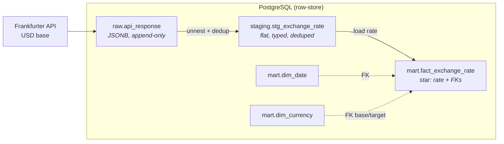
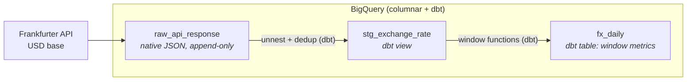
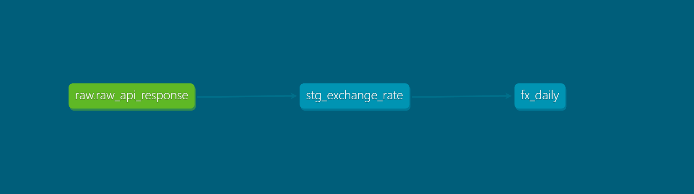

# fx-elt-pipeline


**A daily FX ELT pipeline, re-architected from PostgreSQL to BigQuery + dbt.
Exploring how the same pipeline changes when the storage engine changes.**

Medallion architecture (raw → staging → mart), with data quality tests, source definitions, and generated lineage documentation. Moving from a row-oriented database to a columnar analytical warehouse changes how data should be modeled, transformed, and consumed.

**Stack:** BigQuery · dbt · PostgreSQL · Python · SQL · medallion architecture · dimensional modeling

FX rates make a good case study for this: a daily cadence, a naturally incremental series, and metrics like moving averages and volatility that map to real decisions like timing currency exposure. That shape is what gives the modeling decisions weight; each one answers to how the data behaves and gets used, not just to what the tools can do.

> **Why rebuild instead of starting a new project?**
> Rather than spin up a separate BigQuery project, I rebuilt the same ELT pipeline to see which parts of the design carry over and which need to change when moving from PostgreSQL to BigQuery.
> The interesting part was understanding why the **same** FX data is modeled as a dimensional **star schema** on PostgreSQL (row-store), but as a wide **One Big Table (OBT)** on BigQuery (columnar). **Same data. Different engine. Different modeling decisions.**

---

**Quick nav:** [Architecture](#architecture) · [Engineering Decisions](#engineering-decisions) · [Tech Stack](#tech-stack) · [How to Run](#how-to-run) · [Data Models](#data-models) · [Evolution & Roadmap](#project-evolution--roadmap) · [Structure](#project-structure)

---

## Architecture

Two independent pipelines, same medallion shape (raw → staging → mart), different engine underneath. They don't chain into each other. They're the *same* ELT built on two storage engines so the modeling trade-offs sit side by side.

**PostgreSQL (row-store)**



**BigQuery + dbt (columnar)**



Same three layers map to different objects on each engine:

| Layer | PostgreSQL | BigQuery + dbt |
|-------|-----------|----------------|
| **Raw** | `raw.api_response` (JSONB) | `raw_api_response` (native JSON) |
| **Staging** | `staging.stg_exchange_rate` | `stg_exchange_rate` (dbt view) |
| **Mart** | `mart.fact_exchange_rate` (star) | `fx_daily` (dbt table, OBT) |

Each engine ends up with one mart design, not two: PostgreSQL as a dimensional star schema, BigQuery as a wide OBT. *Why* is covered in [Engineering Decisions](#engineering-decisions).



---

## Engineering Decisions

The data didn't change between versions. The engine did, and that's what drove every decision below.

### Why a star schema on PostgreSQL but an OBT on BigQuery?

The same dataset is modeled two different ways, not because the requirements changed, but because the engine did. The difference isn't stylistic; it's how each engine executes analytical queries.

**PostgreSQL (row-store).** Rows are stored together and joins to small dimensions are cheap, so a dimensional star schema fits: `fact_exchange_rate` holds the raw `rate`, with `dim_date` and `dim_currency` around it. The payoff is flexibility: new ways to slice the data don't require reshaping the fact.

**BigQuery (columnar).** Only the columns a query touches get scanned, so a wide table costs nothing for the columns you ignore, while joins carry more relative cost. A wide table plays to how the engine reads data, so a single **One Big Table** (`fx_daily`) fits better than a star. It helps that `dim_currency` here is tiny and attribute-poor (just a currency code), so there's little to normalize out into a dimension anyway.

**Trade-off.** The OBT is rigid: a new metric means a schema change, not just a new query against dimensions. At this scale that's an acceptable cost, and on a columnar engine it's the shape that pays off. Same data, different engine, different right answer.

### Why store raw JSON instead of flattening on ingestion?

The problem with transforming during ingestion is that you lose the original: if the transform logic changes later, there's nothing to re-derive from without re-calling the API.

So both pipelines land the untouched API payload first (`JSONB` on Postgres, native `JSON` on BigQuery) before any transformation. Raw stays immutable and replayable; everything downstream of raw can be rebuilt from stored payload when logic changes, without re-ingesting the source. It also keeps ingestion and transformation cleanly separated. The extract step just lands data, and all shaping happens later in SQL.

**Trade-off.** Storing raw JSON costs more space than landing pre-flattened rows, and every downstream read pays a parse step. At this data scale both are negligible next to the replayability.

### Why move transformations into dbt?

The Postgres version runs transformation as SQL scripts, sequenced by hand in `main.py`. That works while there are a few steps. Rebuilding on BigQuery, the transformation layer had enough dependencies that ordering them manually stopped being the right approach: the pipeline needed to understand its own shape.

dbt addresses this directly:

- **`ref()` builds the DAG:** dbt reads dependencies between models and runs them in order, so nothing is sequenced by hand.
- **Tests as config:** `not_null`, `accepted_values`, and a composite-grain uniqueness check (`dbt_utils.unique_combination_of_columns`) run against the marts on every build.
- **Lineage for free:** `dbt docs generate` produces the source → staging → mart graph above.

**Trade-off.** dbt adds a dependency and a project structure to learn, overhead a couple of SQL scripts don't have. It earns that back the moment the DAG has more than a couple of nodes or the models need testing.

### Why views for staging but tables for marts?

Not every layer is worth storing. The question for each one is whether recomputing it on demand is cheaper than materializing it.

Staging mostly standardizes and dedupes raw, so it's a **view** (no stored intermediate, always current). The mart runs window functions (moving averages, volatility) that are more expensive to recompute, so it's a **table**, computed once, cached.

**Trade-off.** Incremental materialization was deliberately skipped. At this data scale a full rebuild is cheaper than the complexity of managing incremental state, and BigQuery Sandbox has no DML to run a `MERGE` anyway, so incremental wasn't even on the table here.

### What stayed the same, and what didn't

The engine changed; the fundamentals didn't. Keeping the same backbone across both builds is what made the differences meaningful rather than incidental:

| Carried over | Changed |
|--------------|---------|
| Medallion architecture (raw → staging → mart) | Star schema → One Big Table |
| Raw-first, immutable ingestion | Hand-sequenced SQL → dbt DAG |
| ELT pattern (transform in-warehouse) | `JSONB` → native `JSON` |
| Incremental ingestion concept | Manual testing → dbt tests + lineage |

The backbone is engine-agnostic. The modeling, transformation tooling, and storage details are where a columnar warehouse pulls the design in a different direction than a row-store.

---

## Tech Stack

| Concern | PostgreSQL pipeline | BigQuery pipeline |
|---------|--------------------|--------------------|
| Language | Python 3 (`requests`, `SQLAlchemy`, `python-dotenv`, `logging`) | same extract, dbt for transform |
| Storage | PostgreSQL | BigQuery (Sandbox) |
| Transformation | SQL, executed in-database | dbt (`dbt-bigquery`) |
| Data source | [Frankfurter API](https://frankfurter.dev) (ECB provider) | same |
| Testing | — | dbt tests + `dbt_utils` |
| Linting | SQLFluff | — |

**Data source:** ECB exchange rates with **USD** as the base currency and **THB, JPY, EUR, GBP, and SGD** as target currencies. The ECB is used as the sole data provider to maintain a consistent historical series. Since the ECB does not publish rates on weekends or public holidays, gaps in the data represent missing dates rather than missing currency pairs.

---

## How to Run

### PostgreSQL pipeline

**Prerequisites:** Python 3.10+, a running PostgreSQL instance, `psql` on PATH.

```bash
git clone https://github.com/Kirakiraz/fx-elt-pipeline.git
cd fx-elt-pipeline
pip install -r requirements.txt

cp .env.example .env            # fill in DB credentials

createdb -U <your_user> currency_db
psql -U <your_user> -d currency_db -f init.sql   # run from repo root

python main.py
```

### BigQuery + dbt

The dbt build runs against a BigQuery project and isn't meant to be reproduced end to end (it needs your own GCP project + auth). The workflow, for reference:

```bash
dbt deps                        # install dbt_utils
dbt run                         # build stg (view) → fx_daily (table)
dbt test                        # run data-quality tests
dbt docs generate && dbt docs serve   # build + view lineage graph
```

---

## Data Models

### Star schema (PostgreSQL)

`fact_exchange_rate` holds one row per (`date_key`, base, target) at the grain of a single observed rate, keeping only the raw `rate`. Derived metrics stay out by design, since they're computed across rows and aren't additive at the fact's grain.

- **`dim_date`** is a calendar dimension generated with `generate_series` (2020–2030). The fact joins to it on an integer **`date_key`** (`YYYYMMDD`) rather than a raw date: the standard star-schema surrogate.
- **`dim_currency`** keys on the **ISO 4217 code** (immutable, single source) rather than a surrogate, a natural key that's already stable. Referenced **twice** by the fact (base + target), a role-playing dimension.
- FK constraints on both keys enforce integrity, so loads don't need manual validation joins.

### Serving view (PostgreSQL)

`mart.vw_fx_metrics` sits on top of `fact_exchange_rate` as the layer the DA queries directly. Rather than have consumers read the raw fact, the view gives them a clean, ready-to-use surface — a small serving boundary between the modeled mart and whoever consumes it. It reads from the **fact**, not staging, so the serving layer stays downstream of the mart rather than reaching around it.

It exposes the derived FX metrics (previous-day rate, day-over-day % change, 7- and 30-day moving averages, 30-day volatility) as a compute-on-read view.

### OBT (BigQuery)

`fx_daily` is a single wide table with the derived metrics precomputed per row:

- previous-day rate (`LAG`)
- day-over-day % change
- 7-day and 30-day moving averages
- 30-day volatility (rolling `STDDEV`)

No joins at query time. The trade-off is rigidity: a new metric means a schema change, not just a new query against dimensions.

This is BigQuery's only mart. An earlier version of this table existed on PostgreSQL too, built while first learning the modeling — it's archived in `archive/` now that the star schema is the settled row-store design.

---

## Project Evolution & Roadmap

```
PostgreSQL ELT  →  BigQuery + dbt  →  Analysis layer (pandas + SQL)
   (done)              (done)              (next)
```

- **PostgreSQL:** the original build, medallion ELT, star schema mart, idempotent upserts.
- **BigQuery + dbt:** re-architected for a columnar engine: native JSON raw, dbt models, tests, lineage docs.
- **Analysis layer (next):** extending the existing `analysis/` notebook — rolling averages in pandas alongside the equivalent SQL window functions, as a deliberate comparison of layer-appropriate tooling (pandas for ad hoc analysis vs. SQL for reusable warehouse logic).

**Other improvements on the list:**

- **dbt depth:** incremental models, basic macros, deeper use of `dbt docs`.
- **Expanded data-quality checks:** row-count reconciliation and rate-bound checks between layers.
- **`pytest`:** coverage for the Python extract/load functions.

**Deliberately deferred:** orchestration (Airflow/Cloud Composer). At this pipeline's scale — one daily extract, one dbt run — manual execution isn't a reliability problem worth solving yet; adding a scheduler here would be complexity without a corresponding need.

---

## Project Structure

```
fx-elt-pipeline/
├── sql/                          # PostgreSQL pipeline
│   ├── ddl/
│   │   ├── schema.sql            # fact + dims + constraints
│   │   └── views.sql             # mart.vw_fx_metrics (serving view for DA)
│   ├── seed/                     # dim_date, dim_currency
│   └── transform/                # stg, fact_exchange_rate
├── currency_dbt/                 # BigQuery + dbt project
│   ├── models/
│   │   ├── staging/
│   │   └── marts/                # fx_daily + _schema.yml (tests)
│   ├── dbt_project.yml
│   └── packages.yml
├── archive/                      # fx_daily.sql — early PG OBT, superseded by star schema
├── docs/                         # lineage screenshot, diagrams
├── init.sql                      # Postgres orchestrator (\i ddl + seed)
├── main.py                       # extract + load + run transforms
├── requirements.txt
└── .env.example
```